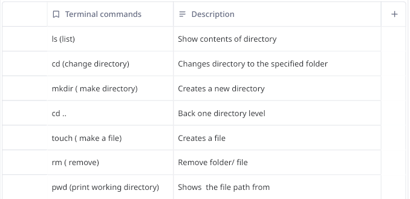

# Hello ! 

>**I'm Baraa Haydarah** 
>I'm a student currently studying **software engineering** . 
> I'm passionate of programming and working hard to covers all the topics that make me a good developer . 
>
>This is my **[github profile](https://github.com/Baraahadi)** is where i share my journey . 

********************
## Good developer mindest 
>let me share with you what did i learn from reading the topic that you mentioned before about good developer mindest that developing is not that difficult thing that to work on it , but to be the good and smart developer this is the real goal that all of us try to work hard on it by some of keys that i found it very usefull for me such as emprace long life learning by engaged yourself into developers community , read documetation about new techiniques to be always up to date the new technology , and by break down huge problems into small issues to solve it step by step then link it all together for the final solution , by think like detective to debugging issues and trying all the times don't depends on assumptions but instead of that focus on details,and work for solve problem users more than just write a clean code , trying to find the best way to write your code with taking care about future of this code ,and for sure be the one who can work with team professionally and focus on maintainance and capacity of this code . 

>finally i wanna to mention to sentense i read it in the topic and it motivated me like i never motivated that ***every expert was once a begginer.*** 

********************
## Terminal Command cheat sheet

